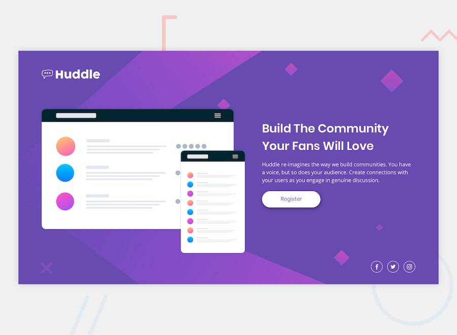
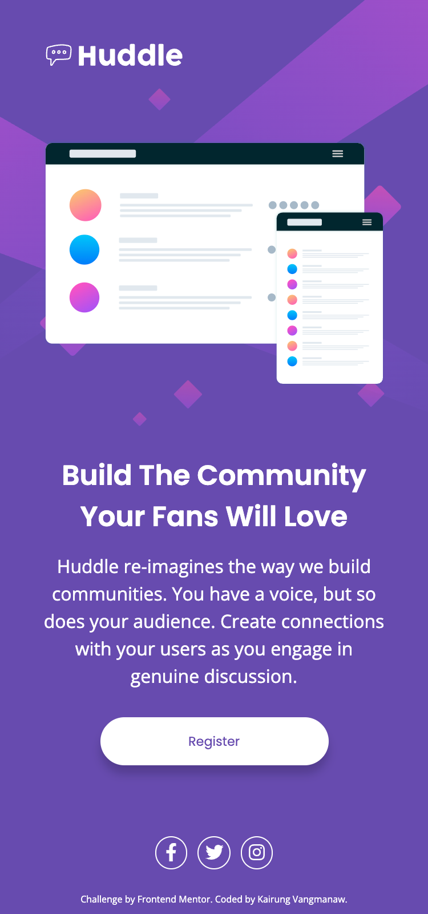
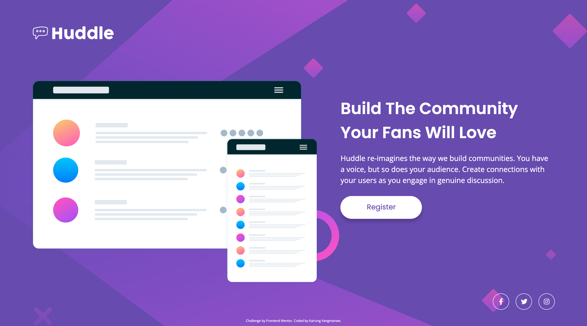
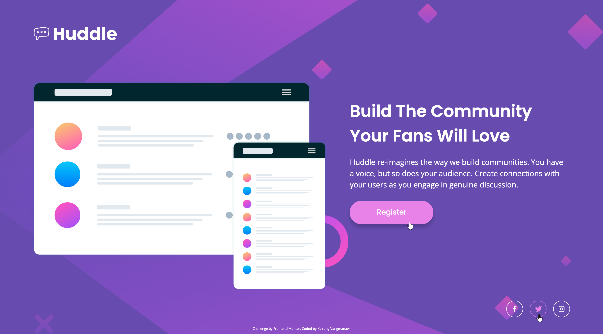

# Frontend Mentor - Huddle landing page with single introductory section solution

This is a solution to the [Huddle landing page with single introductory section challenge on Frontend Mentor](https://www.frontendmentor.io/challenges/huddle-landing-page-with-a-single-introductory-section-B_2Wvxgi0). Frontend Mentor challenges help you improve your coding skills by building realistic projects. 

## Table of contents

- [Frontend Mentor - Huddle landing page with single introductory section solution](#frontend-mentor---huddle-landing-page-with-single-introductory-section-solution)
  - [Table of contents](#table-of-contents)
  - [Overview](#overview)
    - [The challenge](#the-challenge)
    - [Screenshot](#screenshot)
    - [Links](#links)
  - [My process](#my-process)
    - [Built with](#built-with)
    - [What I learned](#what-i-learned)
    - [Continued development](#continued-development)
    - [Useful resources](#useful-resources)
    - [AI Collaboration](#ai-collaboration)
  - [Author](#author)
  - [Acknowledgments](#acknowledgments)

## Overview

### The challenge

Users should be able to:

- View the optimal layout for the page depending on their device's screen size
- See hover states for all interactive elements on the page

### Screenshot

  
Mobile view

  

  
Desktop view

  

  
Active state view

  

### Links

- Solution URL: [Huddle Landing Page with React, BEM CSS, and Accessibility Focus](https://www.frontendmentor.io/solutions/huddle-landing-page-with-react-bem-css-and-accessibility-focus-T6caaru21w)
- Live Site URL: [Frontend Mentor | Huddle landing page with single introductory section](https://challenged-by-frontend-mentor.github.io/huddle-landing-page-with-single-introductory-section/)

## My process

### Built with

- Semantic HTML5 markup
- Mobile-first workflow
- Flexbox & CSS Grid
- BEM (Block Element Modifier) methodology
- CSS Custom Properties (Variables)
- [React](https://react.dev/) - JS Library
- [Vite](https://vitejs.dev/) - Frontend Tooling
- [React Icons](https://react-icons.github.io/react-icons/) - Icon library (`react-icons/fa`)
- Accessibility (a11y) standards (WCAG guidelines, semantic tags, ARIA attributes)
- SEO & Performance Optimizations (Font preloading, preconnect, metadata)

### What I learned

Even though this was a refactoring and re-implementation effort, revisiting a layout like this always brings valuable insights and reinforces core principles:

- **Refining Accessibility (a11y):** Ensuring that interactive elements, especially social media icons wrapped in circular borders, maintain clean click targets while providing clear visual focus indicators using `:focus-visible` and meaningful `aria-label`s without redundant screen reader output.
- **Architectural Cleanliness with BEM:** Deepening strict adherence to BEM naming conventions within React component structures, keeping component styles modular, predictable, and scoped logically.
- **Performance & Font Optimization:** Fine-tuning critical assets by utilizing `preconnect` for Google Fonts, loading only necessary font weights (`400` and `600`), and optimizing HTML metadata to elevate SEO and Lighthouse performance scores.
- **Pixel-Accurate Precision:** Combining design overlay references with native inspection tools to verify alignment, proportions, and responsive typography scalings seamlessly between mobile and desktop viewports.

### Continued development

In future projects, I want to continue refining and expanding on these areas:

- **Advanced CSS Architecture & Tokenization:** Transitioning toward structured Design Tokens for color systems, fluid typography (`clamp()`), and layout spacing for even higher scalability.
- **Micro-interactions & Smooth Motion:** Integrating micro-animations (e.g., subtle hover scale transitions or entry animations using Framer Motion or pure CSS) to make single-section landing pages feel even more dynamic.
- **Automated Accessibility Testing:** Incorporating automated a11y testing tools like `@axe-core/react` or Lighthouse CI into the development pipeline to catch accessibility regressions early.

### Useful resources

- [MDN Web Docs - Accessibility & Semantics](https://developer.mozilla.org/) - An indispensable reference for proper ARIA roles, accessible navigation patterns, and semantic HTML elements.
- [Modern CSS Reset by Andy Bell](https://piccalil.li/blog/a-more-modern-css-reset/) - Great guidelines for establishing consistent cross-browser baseline styles.
- [Google Fonts Documentation](https://fonts.google.com/) - Essential guide for optimizing web font delivery with `preconnect` and specific font-weight subsets.

### AI Collaboration

This project was built in collaboration with AI assistance using **Gemini** and **Google Search AI Mode**. They served as interactive code reviewers, aiding in verifying WCAG accessibility compliance, double-checking cross-browser CSS rules, and fine-tuning BEM naming conventions during refactoring.

## Author

- GitHub: [Kairung Vangmanaw](https://github.com/VangmanawKairung)
- Frontend Mentor - [@VangmanawKairung](https://www.frontendmentor.io/profile/VangmanawKairung)

## Acknowledgments

I would like to express my sincere gratitude to myself for the persistence to rebuild, continuously improve, and strive for pixel-perfect execution, as well as to my family for their unwavering support. 

Special thanks to the Frontend Mentor team for providing such well-structured design challenges that keep pushing frontend skills forward. 

I am also deeply thankful for the modern toolchain that made this workflow smooth and efficient—including AI assistants like Gemini, Visual Studio Code along with its rich extension ecosystem, Google Chrome DevTools, and even simple utility applications like the built-in Preview app on macOS, which allowed me to quickly measure precise pixel values and accelerate the development cycle.